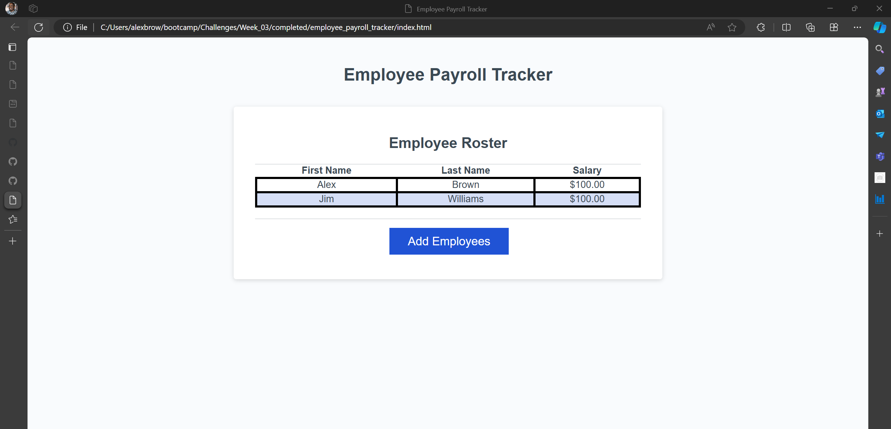

# <Your-Project-Title>

## Description

I am creating a Employee Payroll Tracker to assist Payroll Managers reviewing company empolyee averages in salary and properly budget for the company. 

## Usage

Provide instructions and examples for use. Include screenshots as needed.

To add a screenshot, create an `assets/images` folder in your repository and upload your screenshot to it. Then, using the relative file path, add it to your README using the following syntax:

## Credits

Will A and Mary E collaborated with me to design the project. 

## Badges

## Tests

Tests concluded with employees salary being adveraged correctly.

